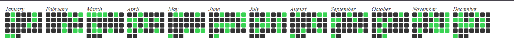

  
# Github calendar component

A reusable React component for displaying a Github-like calendar graph with customizable colors.
## Installation

To install the package, use npm:

```bash
npm install github-calendar-component
```
## Usage

First, import the component into your project:

```javascript
import {Gitgraph} from 'github-calendar-component';
```
Using the Component
``` jsx
import React from 'react';
import {Gitgraph} from 'github-calendar-component';
// Sample test data
const testData = [
  { date: '2022-01-01T00:00:00.000Z', checked: true },
  { date: '2022-01-02T00:00:00.000Z', checked: false },
  // More data...
];

const App = () => {
  return (
    <div>
      <Gitgraph showMonthNames={true} color="blue" data={testData} />
    </div>
  );
};

export default App;

```

### props
| Prop  |  Type |  	Description | Default  |
|---|---|---|---|
| `showMonthNames`  | `boolean`  | Determines whether month names are displayed.  |   `false`|
| `color`  | `string`  |The color to apply for checked dates.   | `#39d353`  |
| `data`  | `Array`  | 	An array of objects containing date and checked properties.  | [ ]  |
| `seperateMonths` | `boolean`| Determinne whether there is space between each month| `false`|


## Author
 [srivenkat13](https://github.com/srivenkat13)